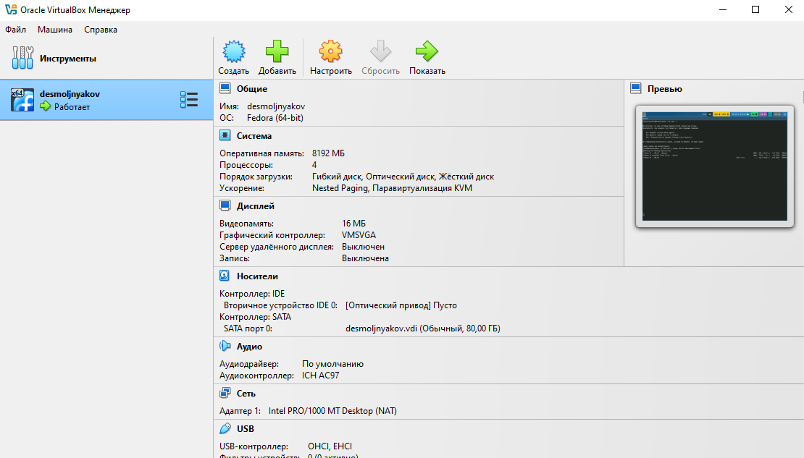
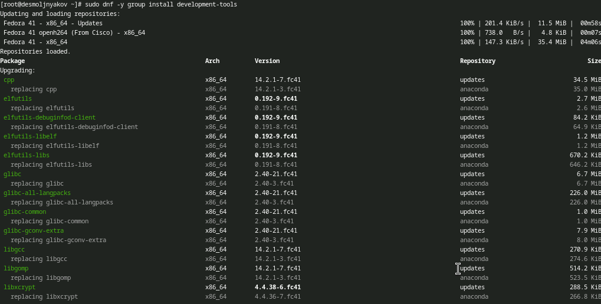
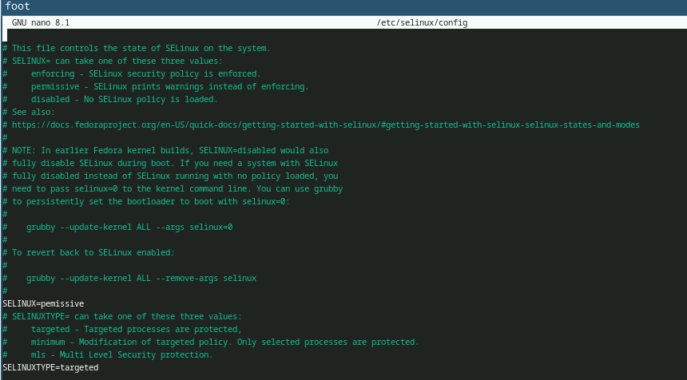
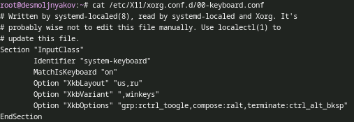
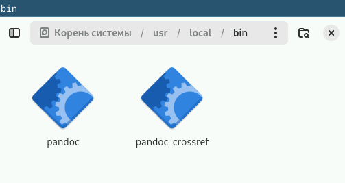
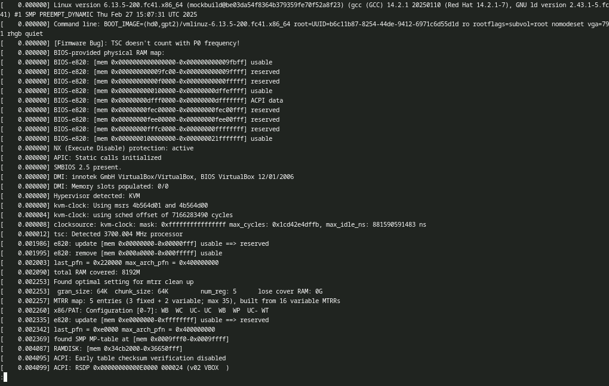

---
## Front matter
lang: ru-RU
title: Установка и настройка операционной системы на виртуальную машину
subtitle: Лабораторная работа 1
author:
  - Смольняков Данил Евгеньевич
institute:
  - Российский университет дружбы народов, Москва, Россия
date: Архитектура компьютеров и ОС

## i18n babel
babel-lang: russian
babel-otherlangs: english

## Formatting pdf
toc: false
toc-title: Содержание
slide_level: 2
aspectratio: 169
section-titles: true
theme: metropolis
header-includes:
 - \metroset{progressbar=frametitle,sectionpage=progressbar,numbering=fraction}
---

# Цель работы

## Цель
- Установка операционной системы на виртуальную машину.
- Настройка минимально необходимых сервисов для дальнейшей работы.

---

# Скриншоты и описание действий

## 1. Подготовка к запуску ОС
- **Действие:** Подготовка виртуальной машины к запуску.
- **Скриншот:**  
  

---

## 2. Переход в режим суперпользователя
- **Действие:** Выполнение команды `sudo -i` для получения прав администратора.
- **Скриншот:**  
  

---

## 3. Установка development-tools
- **Действие:** Установка пакетов для разработки с помощью команды `dnf -y group install development-tools`.
- **Скриншот:**  
  

---

## 4. Настройка SELinux
- **Действие:** Изменение конфигурации SELinux на `permissive` для отключения строгой политики безопасности.
- **Скриншот:**  
  

---

## 5. Создание конфигурационного файла
- **Действие:** Создание файла конфигурации для настройки раскладки клавиатуры.
- **Скриншот:**  
  

---

## 6. Редактирование конфигурационного файла
- **Действие:** Настройка параметров раскладки клавиатуры в файле конфигурации.
- **Скриншот:**  
  

---

## 7. Просмотр конфигурации клавиатуры
- **Действие:** Проверка настроек клавиатуры с помощью команды `cat /etc/X11/xorg.conf.d/00-keyboard.conf`.
- **Скриншот:**  
  

---

## 8. Установка Pandoc и Pandoc-crossref
- **Действие:** Установка инструментов для работы с Markdown и создания документов.
- **Скриншот:**  
  

---

## 9. Установка TeXlive
- **Действие:** Установка TeXlive для работы с LaTeX и создания PDF-документов.
- **Скриншот:**  
  

---

## 10. Конфигурация системы
- **Действие:** Просмотр информации о системе с помощью команды `dmesg`.
- **Скриншот:**  
  

---

# Контрольные вопросы

## Ответы
1. **Учётная запись пользователя:**  
   Имя, UID, GID, домашний каталог, shell, пароль.

2. **Команды терминала:**  
   - `help команда` — справка по команде.  
   - `cd ~` — переход в домашний каталог.  
   - `ls` — просмотр содержимого каталога.  
   - `du -sh /путь` — определение объёма каталога.  
   - `mkdir`, `rmdir`, `touch`, `rm` — создание и удаление каталогов и файлов.  
   - `chmod` — изменение прав доступа.  
   - `history` — просмотр истории команд.

3. **Файловая система:**  
   - **ext4**: Стандартная для Linux.  
   - **NTFS**: Для Windows.  
   - **FAT32**: Универсальная, но с ограничениями.  
   - **XFS**: Высокая производительность для Linux.

4. **Подмонтированные файловые системы:**  
   Используйте команду `df -h` или `mount`.

5. **Удаление зависшего процесса:**  
   - Найдите PID: `ps aux | grep имя_процесса`.  
   - Завершите процесс: `kill PID`.  
   - Принудительно: `kill -9 PID`.

---

# Заключение

## Выводы
- Операционная система успешно установлена на виртуальную машину.
- Настроены необходимые сервисы и инструменты для дальнейшей работы.